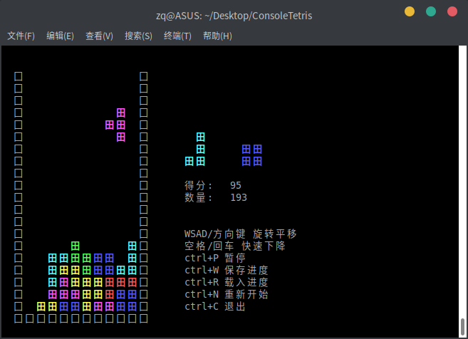

# ConsoleTetris

C语言实现的控制台俄罗斯方块

> **彩色显示**
> 
> **跨平台支持：Posix(Linux, MacOS, ...) 以及 Windows**
> 
> **可以保存/载入进度**



# 显示问题

游戏界面为中文，且使用汉字充当方块，所以需要控制台能够支持汉字显示。

如有需要，可以修改`platform_*.c`中的`print_block`函数实现自定义方块显示风格，只要保证其占2个英文字符宽度即可。

# 编译命令

- Posix
  ```
  gcc -o ConsoleTetris main.c platform_posix.c
  ```
  
- Win32
  ```
  cl /source-charset:utf-8 /FeConsoleTetris.exe main.c platform_win32.c
  ```
  
  其中`/source-charset:utf-8`表示源文件编码，使用Windows编译应该显式指定之

[预编译版下载](https://github.com/zq-97/ConsoleTetris/releases)

# 扩展平台支持

实现`platform.h`中声明的全部函数即可，`main.c`只使用了C标准库，所以不需要改动。