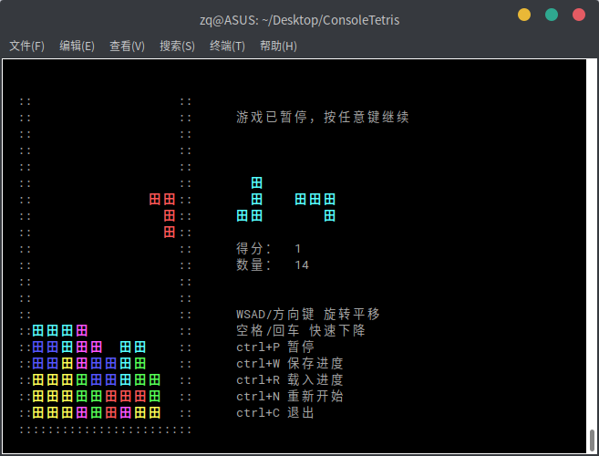
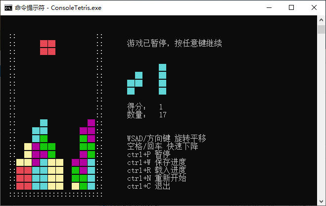

# ConsoleTetris

C语言实现的控制台俄罗斯方块

> **彩色显示**
> 
> **跨平台支持：Posix(Linux, Mac, ...) 以及 Windows**
> 
> **可以保存/载入进度**





# 显示问题

游戏界面为中文，所以需要控制台能够支持汉字显示。

本来希望用UNICODE字符“▇”充当方块显示，无奈其在Linux/MAC终端里只占一个英文字符宽度，所以Posix下使用汉字 “田”代替。

如有需要，可以修改`platform_*.c`中的`print_block`函数实现自定义方块显示风格，只要保证其占2个英文字符宽度即可。

# 编译命令

- Posix
  ```
  gcc -O3 -o ConsoleTetris main.c platform_posix.c
  ```
  
- Win32
  ```
  cl /O2 /source-charset:utf-8 /FeConsoleTetris.exe main.c platform_win32.c
  ```
  
  Windows编译注意：
  
  - `/source-charset:utf-8`必不可少，这是源文件的字符编码
  - `/execution-charset`选项可以缺省，默认使用本机页面编码，如果要为其他机器编译，需显式指定为其对应的页面编码

[预编译版下载](https://github.com/zq-97/ConsoleTetris/releases)

# 扩展平台支持

实现`platform.h`中声明的全部函数即可，`main.c`只使用了C标准库，所以不需要改动。